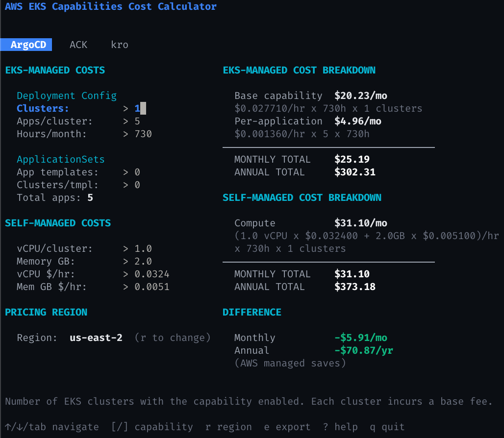
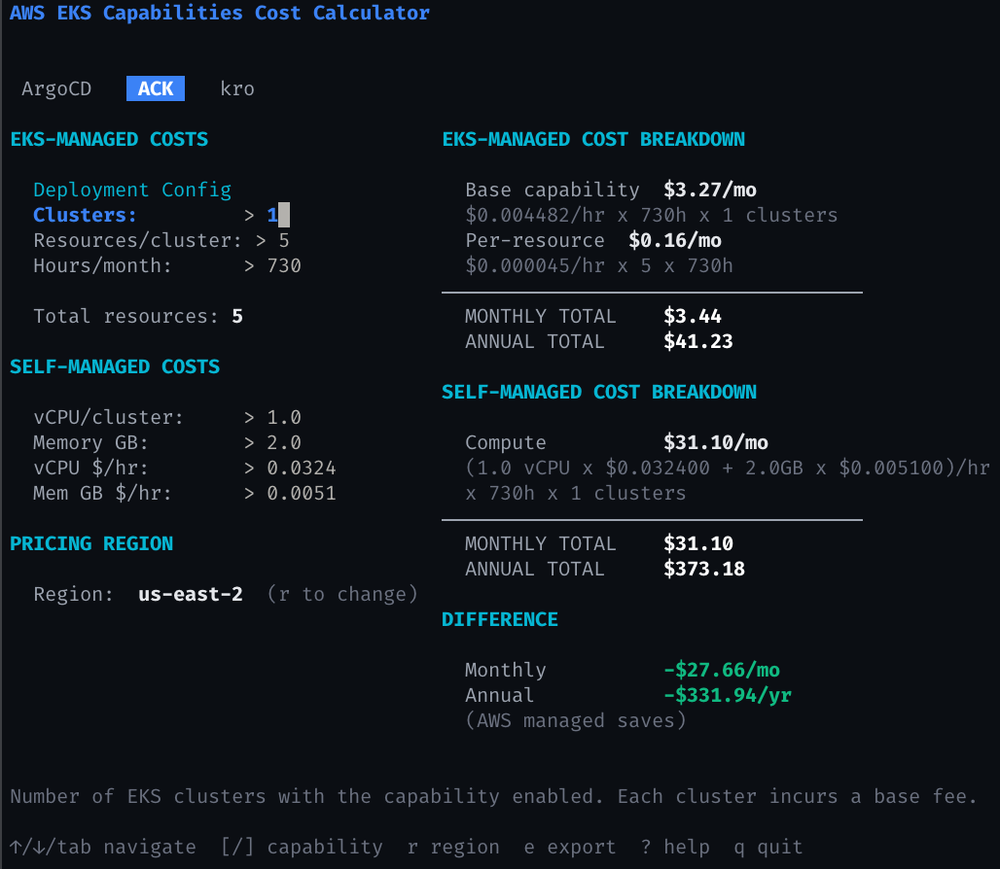
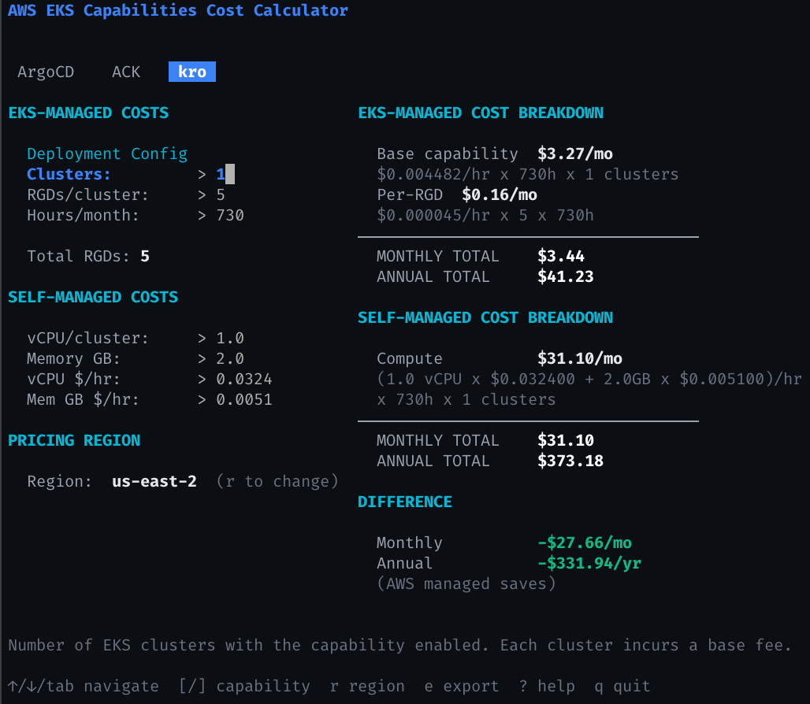

# aws-eks-calculator

A terminal UI for estimating the cost of AWS EKS Capabilities (ArgoCD, ACK, kro) vs self-managed alternatives. Assumes existing EKS clusters.

## Install

```sh
go install github.com/josegonzalez/aws-eks-calculator@latest
```

Or build from source:

```sh
git clone https://github.com/josegonzalez/aws-eks-calculator
cd aws-eks-calculator
make build
```

## Usage

```sh
aws-eks-calculator
```

### Keybindings

| Key              | Action                          |
|------------------|---------------------------------|
| `tab`/`shift+tab`| Navigate between input fields  |
| `[`/`]`         | Previous / next capability        |
| `r`              | Open region picker              |
| `e`              | Export to CSV                   |
| `?`              | Show help                       |
| `q`/`ctrl+c`    | Quit                            |

## AWS Credentials

Live pricing requires AWS credentials with `pricing:GetProducts` permission. Without credentials, hardcoded default rates are used. See [docs/authentication.md](docs/authentication.md) for details.

## How Calculations Work

See [docs/calculations.md](docs/calculations.md) for the full breakdown of how costs are calculated, including formulas, worked examples, and caveats for the self-managed comparison.

## Screenshots

| | |
|---|---|
| <a href="docs/screenshots/argocd.png"><br>ArgoCD</a> | <a href="docs/screenshots/ack.png"><br>ACK</a> |
| <a href="docs/screenshots/kro.png"><br>kro</a> | |
